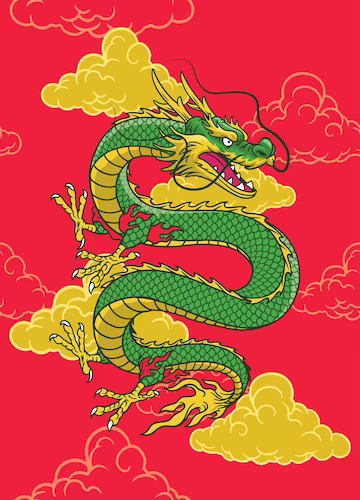

https://github.com/DwardEE

```{r setup, message=FALSE, warning=FALSE}
library("ape")
library("reshape2")
library("ggplot2")
library("ggtree")
```

## Dragons Introduction

Note: I decided to include a narration to give these dragons some backstory as per assignment suggestion, but the analysis later on is more a meta-analysis of the phylogeny tree itself.

### Armoured Ice Dragon


Deep in the heart of the Arctic Circle, there is a creature unlike any other. It's the stuff of legend and lore, a beast so fearsome that even the bravest of warriors shudder at the mere mention of its name. This creature is known as the Armoured Ice Dragon.

This majestic species of dragon has adapted perfectly to its harsh environment. It's covered in a thick layer of icy armor that protects it from the brutal cold and icy winds that sweep across the frozen tundra. Its scales are like glittering diamonds, shimmering in the pale sunlight that filters through the ice and snow.

But the Armoured Ice Dragon is not just an impressive sight to behold, it's also a powerful force to be reckoned with. Its massive wings allow it to soar through the sky, while its sharp claws and teeth make it a formidable predator. Its breath is icy cold, freezing anything it touches in an instant.

Despite its intimidating appearance, the Armoured Ice Dragon is a highly intelligent creature with a complex social structure. It's not uncommon to see groups of these dragons flying together, working together to hunt and protect their territory. They have a strong sense of loyalty to their family and will stop at nothing to defend their kin.

For centuries, humans have been fascinated by the legend of the Armoured Ice Dragon. Some believe that they hold the key to immortality, while others see them as a symbol of power and strength. But for those who have encountered them in the wild, they know that the Armoured Ice Dragon is a truly remarkable creature that deserves our respect and admiration.

### Red Snake Dragon


In the lush green forests, there exists a creature that few have ever seen - the Red Snake Dragon. This magnificent species of dragon is not only known for its massive size and striking red scales, but also for its enormous antlers that give it a majestic and regal appearance.

Living near the thundering waterfalls that cascade through the forest, the Red Snake Dragon has adapted perfectly to its environment. Its scales are as red as the leaves of the trees in autumn, blending in with the vibrant colors of the forest. Its antlers are long and sharp, perfectly suited for navigating the steep rocky terrain around the waterfalls.

Despite its intimidating appearance, the Red Snake Dragon is not aggressive towards humans. In fact, it's said that those who are lucky enough to encounter it are often left with a sense of awe and wonder. The dragon's massive size and graceful movements are a sight to behold, and its powerful presence is impossible to ignore.

But don't be fooled by its gentle nature. The Red Snake Dragon is a formidable hunter and predator, using its sharp claws and teeth to take down prey. Its long, forked tongue can sense the slightest movements around it, making it a master of stealth and ambush.

While little is known about the social behavior of the Red Snake Dragon, it's believed that they are highly intelligent creatures with a strong sense of family and community. They are known to gather near the waterfalls in groups, often sharing hunting grounds and resources with one another.

For centuries, the Red Snake Dragon has been a symbol of power and strength, inspiring awe and wonder in those who have been lucky enough to see it. It's a creature that represents the untamed beauty of nature, a reminder of the mysteries that lie deep within the forest.

### Green Chinese Dragon



Deep within the mountainous regions of China, there exists a creature unlike any other - the Green Chinese Dragon. Known for its striking green scales, long whiskers, and bird-like talons, this dragon is revered as a symbol of power, wisdom, and immortality.

According to legend, the Green Chinese Dragon is a creature of divine origin, born from the swirling mists of creation itself. It's said that this dragon possesses an innate ability to control the elements, commanding the wind, water, and fire to do its bidding.

But perhaps the most remarkable thing about the Green Chinese Dragon is its immortality. It's believed that this dragon has been alive for thousands of years, watching over the land and its people with a wisdom that few can match.

Despite its age, the Green Chinese Dragon is a creature of immense power and grace. Its long whiskers are sensitive to the slightest movements in the air, allowing it to navigate even the most treacherous of landscapes. Its bird-like talons are sharp and powerful, able to grip even the smoothest surfaces with ease.

While little is known about the social behavior of the Green Chinese Dragon, it's believed that these creatures are highly intelligent and possess a strong sense of community. They are often depicted in ancient artwork and literature as protectors of the land, using their elemental powers to bring rain, tame wildfires, and ward off natural disasters.

## Creating the Phylogeny Tree

```{r, warning=F,message=F}
library(ape)
DragonNexus<-read.nexus.data("DragonMatrix.nex")

# Reading in the traits and info for the 3 new species
new_info <- as.matrix(read.csv("input/new_traits.txt", colClasses="character", header = FALSE))

# Adding the rows read as data to the DragonNexus list
DragonNexus[["75SnakeXXX"]] <- as.character(unlist(new_info[1,]))
DragonNexus[["76IceXXXXX"]] <- as.character(unlist(new_info[2,]))
DragonNexus[["77ChineseX"]] <- as.character(unlist(new_info[3,]))

# Saving new data and updating DragonNexus
write.nexus.data(DragonNexus, file = "NewDragonMatrix.nex")
DragonNexus <- read.nexus.data("NewDragonMatrix.nex")
```

The remaining process (including weights) is derived from the tutorial provided for this week as per assignment instruction.

```{r}
WeightsDat<-read.csv("Weights.csv")
```

```{r}
Weights<-paste0(WeightsDat$Weight,collapse="")
Weights<-strsplit(Weights,split="")[[1]]
```

```{r}
WeightsNum<-rep(NA,length(Weights))
for(i in 1:length(WeightsNum)){
  if(Weights[i] %in% LETTERS){
    WeightsNum[i]<-which(LETTERS==Weights[i])+9
  } else {
    WeightsNum[i]<-Weights[i]
  }
}
WeightsNum<-as.numeric(WeightsNum)
```

```{r}
WtDragonNexus<-DragonNexus # Make a new weighted data frame object
for (i in 1:length(DragonNexus)){
  RepWeight<-DragonNexus[[i]]==1
  WtDragonNexus[[i]][RepWeight]<-WeightsNum[RepWeight]
  RepWeight<-NA
}
```

```{r}
WtDragonNexusDF<-data.frame(matrix(unlist(WtDragonNexus),ncol=78,byrow=T))
row.names(WtDragonNexusDF)<-names(WtDragonNexus)
WtDragonDist<-dist(WtDragonNexusDF,method='euclidean')
WtDragonDistMat<-as.matrix(WtDragonDist)
```

```{r}
WtPDat<-melt(WtDragonDistMat)
ggplot(data = WtPDat, aes(x=Var1, y=Var2, fill=value)) + 
  geom_tile()+scale_fill_gradientn(colours=c("white","blue","green","red")) +
  theme(axis.text.x = element_text(angle = 90, hjust = 1, vjust = 0.5))
```
```{r, fig.width=10}
WtDragonTree<-fastme.bal(WtDragonDist)
ggtree(WtDragonTree,layout="circular") + geom_tiplab(size=3,aes(angle=angle)) + geom_hilight(node = 7) + geom_hilight(node = 30) + geom_hilight(node = 42)
```

Figure 1: A circular phylogeny tree with the new species included. These additions are highlighted to be more easily identifiable. The 75SnakeXXX is the Red Snake Dragon, the 76IceXXXXX represents the Armoured Ice Dragon, and the 77ChineseX is the Green Chinese Dragon Species.  


```{r, fig.width=10, warning=FALSE}
WtDTclade<-groupClade(WtDragonTree,.node=c(134,148,99,85,124))
ggtree(WtDTclade,layout="circular",aes(colour=group)) + 
  geom_cladelabel(node=148,label="Serpentidae",hjust=0.5,offset.text=4,fontsize=3,angle=-45) +
  geom_cladelabel(node=134,label="Wyvernidae",hjust=0.5,offset.text=4,fontsize=3,angle=15) +
  geom_cladelabel(node=99,label="Orientalia",hjust=0.5,offset.text=4,fontsize=3,angle=40) +
  geom_cladelabel(node=85,label="Dracopteronidae",hjust=0.5,offset.text=4,fontsize=3,angle=-55) +
  geom_cladelabel(node=125,label="Dracoverisidae",hjust=0.5,offset.text=6,fontsize=3,angle=55) +
  xlim(NA,60) + geom_hilight(node = 7) + geom_hilight(node = 30) + geom_hilight(node = 42)
```

Figure 2: Grouping the species based on the clades that were included in the initial tutorial. The new additions to the phylogeny are highlighted to help identifying them.

## Analysis

Regarding where the dragon species were placed in the phylogeny tree based on the trait encoding I provided, the results are mostly what would be expected. The Green Chinese Dragon is within the clade, Orientalia, clustered with the other Asian depictions of dragons that share similar phenotypic traits, in this case, due to the cultural overlap of the Eastern Asian Countries. As for the Red Snake Dragon, it clusters into the Dracopteronidae clade, but more specifically, its closest relatives are snake-like dragons such as 0.2SnakeXX and 6AmericanX; therefore, this placement should be the expected outcome.  In contrast, the Armoured Ice Dragon appears to be somewhat isolated, with its closest related clade being Orientalia, albeit distantly. The reasoning that this may be the case may be due to human error with the trait encoding. There are certain traits that the dragon species have that seem to be hard to classify with the system and traits given. Misinterpretation of a highly weighted trait may have contributed to this confusing classification.


